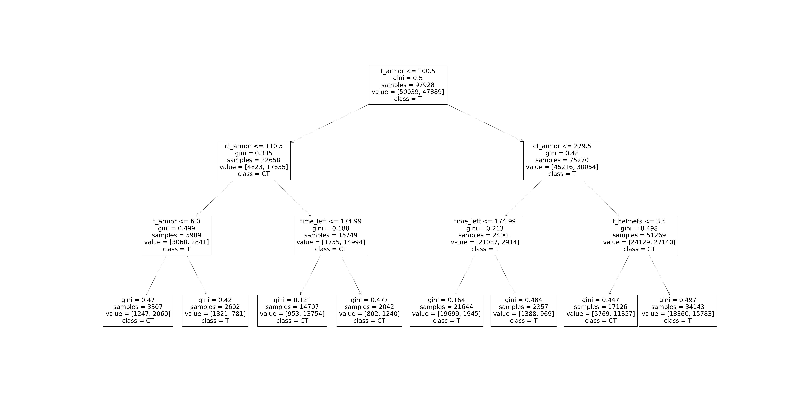

# Лабораторная работа №1. Представление деревьев решений в виде дизъюнктов Хорна.
##  Выбор набора данных
В качестве датасета используется [CS:GO Round Winner Classification](https://www.kaggle.com/datasets/christianlillelund/csgo-round-winner-classification?datasetId=833303&sortBy=voteCount), 
содержащий данные о матчах с турниров по игре CS:GO.

На основе информации о времени до конца раунда, очках здоровья оставшихся игроков, наличия денег в обеих командах и др. можно определить, какая команда выиграет конкретный раунд игры: CT (Counter-Terrorists) или T (Terrorists).

## Полученное дерево решений

## Ручное описание дерева решений с помощью утверждений Datalog
    (label[U] == 'CT') <= (ct_armor[U] <= 110.5) & (t_armor[U] <= 6.0) 
    (label[U] == 'T') <= (t_armor[U] <= 100.5) & (ct_armor[U] <= 110.5) & (t_armor[U] > 6.0) 
    (label[U] == 'CT') <= (t_armor[U] <= 100.5) & (ct_armor[U] > 110.5)
    (label[U] == 'T') <= (t_armor[U] > 100.5) & (ct_armor[U] <= 279.5)
    (label[U] == 'CT') <= (t_armor[U] > 100.5) & (ct_armor[U] > 279.5) & (t_helmets[U] <= 3.5) 
    (label[U] == 'T') <= (t_armor[U] > 100.5) & (ct_armor[U] > 279.5) & (t_helmets[U] > 3.5)
## Проверка классификации объектов с помощью cоставленных утверждений
    # Test 0 (CT)
    t_armor[0] = 1
    ct_armor[0] = 50.5
    print(label[0] == U, end='\n\n')
    
    U 
    --
    CT
    ..................................
    # Test 5 (T)
    t_armor[5] = 300
    ct_armor[5] = 280
    t_helmets[5] = 5
    print(label[5] == U)

    U
    -
    T
## Динамическое формирование утверждений Datalog на основе дерева решений, обученного с другими гиперпараметрами
* **Предложенный алгоритм отличается от лекционного.**
### Полученное дерево глубины 4:

### Полученные динамически выражения
#### Без оптимизаций:
    ["(label[U] == 'T') <= (t_armor[U] <= 100.5) & (ct_armor[U] <= 110.5) & (t_armor[U] <= 6.0) & (ct_armor[U] <= 73.5)",
     "(label[U] == 'CT') <= (t_armor[U] <= 100.5) & (ct_armor[U] <= 110.5) & (t_armor[U] <= 6.0) & (ct_armor[U] > 73.5)",
     "(label[U] == 'T') <= (t_armor[U] <= 100.5) & (ct_armor[U] <= 110.5) & (t_armor[U] > 6.0)",
     "(label[U] == 'CT') <= (t_armor[U] <= 100.5) & (ct_armor[U] > 110.5) & (time_left[U] <= 174.99)",
     "(label[U] == 'CT') <= (t_armor[U] <= 100.5) & (ct_armor[U] > 110.5) & (time_left[U] > 174.99)",
     "(label[U] == 'T') <= (t_armor[U] > 100.5) & (ct_armor[U] <= 279.5) & (time_left[U] <= 174.99)",
     "(label[U] == 'T') <= (t_armor[U] > 100.5) & (ct_armor[U] <= 279.5) & (time_left[U] > 174.99)",
     "(label[U] == 'CT') <= (t_armor[U] > 100.5) & (ct_armor[U] > 279.5) & (t_helmets[U] <= 3.5)",
     "(label[U] == 'T') <= (t_armor[U] > 100.5) & (ct_armor[U] > 279.5) & (t_helmets[U] > 3.5) & (ct_armor[U] <= 420.5)",
     "(label[U] == 'CT') <= (t_armor[U] > 100.5) & (ct_armor[U] > 279.5) & (t_helmets[U] > 3.5) & (ct_armor[U] > 420.5)"]
#### C оптимизациями:
    ["(label[U] == 'T') <= (t_armor[U] <= 6.0) & (ct_armor[U] <= 73.5)",
    "(label[U] == 'CT') <= (ct_armor[U] <= 110.5) & (t_armor[U] <= 6.0) & (ct_armor[U] > 73.5)",
    "(label[U] == 'T') <= (t_armor[U] <= 100.5) & (ct_armor[U] <= 110.5) & (t_armor[U] > 6.0)",
    "(label[U] == 'CT') <= (t_armor[U] <= 100.5) & (ct_armor[U] > 110.5)",
    "(label[U] == 'T') <= (t_armor[U] > 100.5) & (ct_armor[U] <= 279.5)",
    "(label[U] == 'CT') <= (t_armor[U] > 100.5) & (ct_armor[U] > 279.5) & (t_helmets[U] <= 3.5)",
    "(label[U] == 'T') <= (t_armor[U] > 100.5) & (ct_armor[U] > 279.5) & (t_helmets[U] > 3.5) & (ct_armor[U] <= 420.5)",
    "(label[U] == 'CT') <= (t_armor[U] > 100.5) & (t_helmets[U] > 3.5) & (ct_armor[U] > 420.5)"]

## Тестирование классификации при динамическом формировании утверждений
    # n = 10001
    ct_helmets[10001] = 3.0
    t_helmets[10001] = 2.0
    ct_players_alive[10001] = 4.0
    t_players_alive[10001] = 2.0
    label = CT

    print(pyDatalog.ask('label[U] == V'))
    {(10001, 'CT')}